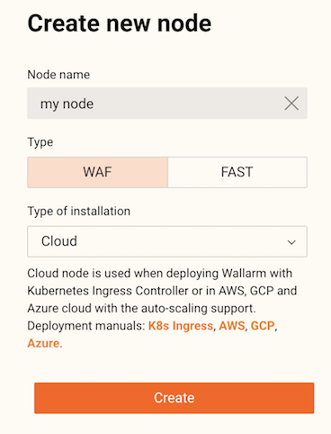

# Installation in the Kubernetes Cluster

* [System Requirements](#system-requirements)
* [Installation](#installation)
* [Configuration](#configuration)
* [Known Restrictions](#known-restrictions)

## System Requirements

* Kubernetes platform version 1.15 or lower
* [Helm](https://helm.sh/) package manager
* Compatibility of your services with the official [NGINX Ingress Controller](https://github.com/kubernetes/ingress-nginx)

!!! info "See also":"
    * [What is Ingress?](https://kubernetes.io/docs/concepts/services-networking/ingress/)
      * [Installation of Helm](https://helm.sh/docs/intro/install/)

[Back to the table of contents ▲](#installation-in-the-kubernetes-cluster)

## Installation

1. [Install](#step-1-installing-the-wallarm-ingress-controller) the Wallarm Ingress controller.
2. [Enable](#step-2-enabling-traffic-analysis-for-your-ingress) traffic analysis for your Ingress.
3. [Check](#step-3-checking-the-wallarm-ingress-controller-operation) the Wallarm Ingress controller operation. 

### Step 1: Installing the Wallarm Ingress Controller

Select the method of the controller installation:
* creation of a new controller,
* replacement of an existing controller.

#### Creating a New Controller

1. Go to your Wallarm account > the **Nodes** tab by the link below:
   * https://my.wallarm.com/nodes for the EU cloud,
   * https://us1.my.wallarm.com/nodes for the US cloud.
2. Create the filter node with the **Cloud** type and copy the token.
    
3. Clone the repository of Wallarm NGINX Ingress:
   ```term
    # git clone https://github.com/wallarm/ingress-chart
    ```
4. Open the `ingress-chart/wallarm-ingress/values.yaml` file of the cloned repository and specify the following parameter values:
    * `wallarm.enabled: true`
    * `wallarm.token: "YOUR_CLOUD_NODE_TOKEN"`
5. Go to the `ingress-chart` directory and install the Wallarm Ingress controller:
   ```term
    # cd ..
    # helm install INGRESS_CONTROLLER_NAME ingress-chart/wallarm-ingress -n KUBERNETES_NAMESPACE
    ```
    * `INGRESS_CONTROLLER_NAME` is the name of the Wallarm Ingress controller,
    * `KUBERNETES_NAMESPACE` is the namespace of your Ingress.

#### Replacing an Existing Controller

1. Go to your Wallarm account > the **Nodes** tab by the link below:
   * https://my.wallarm.com/nodes for the EU cloud,
   * https://us1.my.wallarm.com/nodes for the US cloud.
2. Create the filter node with the **Cloud** type and copy the token.
    
3. Clone the repository of Wallarm NGINX Ingress:
   
   ```term
    # git clone https://github.com/wallarm/ingress-chart
    ```
4. Open the `ingress-chart/wallarm-ingress/values.yaml` file of the cloned repository and specify the following parameter values:
    * `wallarm.enabled: true`
    * `wallarm.token: "YOUR_CLOUD_NODE_TOKEN"`
5. Replace an existing controller:
   
    ```term
    # helm upgrade INGRESS_CONTROLLER_NAME KUBERNETES_NAMESPACE --reuse-values
    ```
    * `INGRESS_CONTROLLER_NAME` is the name of the Ingress controller to replace,
    * `KUBERNETES_NAMESPACE` is the namespace of your Ingress.

### Step 2: Enabling Traffic Analysis for Your Ingress

```term
# kubectl annotate ingress YOUR_INGRESS_NAME nginx.ingress.kubernetes.io/wallarm-mode=monitoring
# kubectl annotate ingress YOUR_INGRESS_NAME nginx.ingress.kubernetes.io/wallarm-instance=INSTANCE
```
* `YOUR_INGRESS_NAME` is the name of your Ingress,
* `INSTANCE` is a positive number which is unique to each of your applications or application groups. This will allow you to obtain separate statistics and distinguish between the attacks aimed at corresponding applications.

### Step 3: Checking the Wallarm Ingress Controller Operation

1. Get the list of pods specifying the name of the Wallarm Ingress controller in `INGRESS_CONTROLLER_NAME`:
   ```term
    # kubectl get po -l release=INGRESS_CONTROLLER_NAME
    ```

    Each pod should display the following: "STATUS: Running" and "READY: N/N". For example:

    ```
    NAME                                                              READY     STATUS    RESTARTS   AGE
    ingress-controller-nginx-ingress-controller-675c68d46d-cfck8      3/3       Running   0          5m
    ingress-controller-nginx-ingress-controller-wallarm-tarantljj8g   8/8       Running   0          5m
    ingress-controller-nginx-ingress-default-backend-584ffc6c7xj5xx   1/1       Running   0          5m
    ```
2. Send a test attack to your Ingress resource as described in this [documentation](../quickstart-en/qs-check-operation-en.md/2-run-a-test-attack).
3. Go to your Wallarm account > the **Events** tab by the link below and check that an attack is displayed in the list:
   * https://my.wallarm.com for the EU cloud,
   * https://us1.my.wallarm.com for the US cloud.

[Back to the table of contents ▲](#installation-in-the-kubernetes-cluster)

## Configuration

After the Wallarm Ingress controller is successfully installed and checked, you can make advanced configurations to the solution such as:
* enable blocking requests from particular IP addresses,
* set up the response code and page that are returned to the client when an invalid request has been blocked,
* enable WebSockets messages analyzing, etc.

To find parameters used for advanced configuration and appropriate instructions, please follow the [link](configure-kubernetes-en.md).

[Back to the table of contents ▲](#installation-in-the-kubernetes-cluster)

## Known Restrictions

* IP blocking is not supported in Wallarm Node version 2.12 or lower.
* Operation without the postanalytics service is not supported. 
* Scaling down postanalytics service may result in a partial loss of attack data.

[Back to the table of contents ▲](#installation-in-the-kubernetes-cluster)