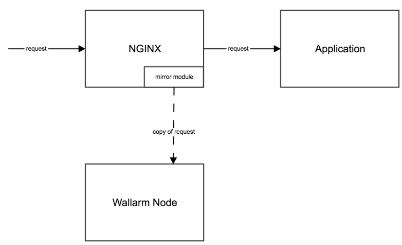

# Analyzing Mirrored Traffic with NGINX

Starting with NGINX 1.13 you can mirror the traffic to an additional backend. Installing a Wallarm node as the addtional backend lets you run an analysis of the traffic copy without considerable changes to the production system.

This setup is useful to:

* Quickly pilot a project.
* Be sure that the protection service will not affect application's performance.
* Train the system on the traffic copy before running the module on the production system.

Limitations:

* Only requests are analyzed; responses are not analyzed.
* The attacks are not blocked in real time on the request level.

## Configuration

### General Diagram



1. Configure NGINX: install the module and configure the request mirroring.
2. Install and configure the Wallarm node. See [Installing as a dynamic module for NGINX](installation-nginx-en.md).

On step 1, install the mirroring module [ngx_http_mirror_module](https://nginx.org/en/docs/http/ngx_http_mirror_module.html) and configure the request mirroring to an additional backend.

On step 2, as an additional backend, install the Wallarm node.

### Configure NGINX

Configure mirroring with the `mirror` directive that you can set inside the `location` or `server` block.

Example of mirrored requests to `location /` on `location /mirror-test`:

```
location / {
        mirror /mirror-test;
        mirror_request_body on;
        root   /usr/share/nginx/html;
        index  index.html index.htm; 
    }
    
location /mirror-test {
        internal;
        #proxy_pass http://111.11.111.1$request_uri;
        proxy_pass http://222.222.222.222$request_uri;
        proxy_set_header X-SERVER-PORT $server_port;
        proxy_set_header X-SERVER-ADDR $server_addr;
        proxy_set_header HOST $http_host;
        proxy_set_header X-REAL-IP  $remote_addr;
        proxy_set_header X-Request-ID $request_id;
    }
```

In `location`, to send the mirrored traffic, you must list the headers that will be sent. As an IP address, set the machine with the Wallarm node that receives the traffic copy.

### Configure the Wallarm Node to Receive the Mirrored Traffic

To have the Wallarm interface display the IP addresses of the attackers, configure `real_ip_header` and disable the request processing – the requests will not be analyzed with the `wallarm_force_response_*` directives as only copies of the requests are sent.

Example of the configured `real_ip_header` with the disabled requests handling:

```
wallarm_force server_addr $http_x_server_addr;
wallarm_force server_port $http_x_server_port;
#Change 222.222.222.22 to the mirror server address
set_real_ip_from  222.222.222.22;
real_ip_header    X-REAL-IP;
#real_ip_recursive on;
wallarm_force response_status 0;
wallarm_force response_time 0;
wallarm_force response_size 0;
```