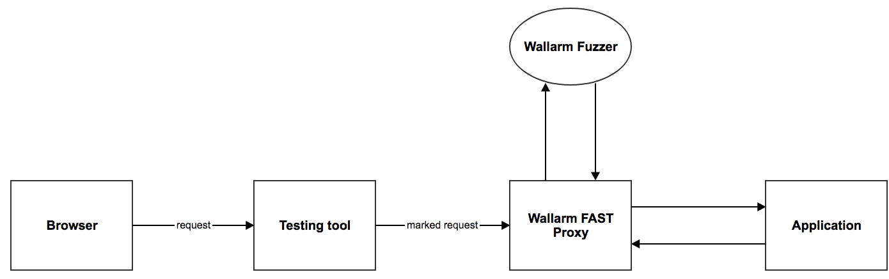

# Testing your Applications

You can use the *Test run* feature to test your application against vulnerabilities before putting it in production.

To run a test, you must have:

* The Wallarm FAST Proxy Docker container. The container provides access to the application for your requests only.
* Any web application testing tool. For example, Burp Suite.
* The *Test run* feature in the Wallarm cloud at https://my.wallarm.com/

## How It Works



1. The request passes from browser to the testing tool.
2. The testing tool adds `X-Wallarm-Marker` to the header of the request and a unique token.
3. The request with `X-Wallarm-Marker` and a unique token is passed to Wallarm FAST Proxy.
4. Wallarm FAST Proxy sends the request to the application.
5. The application returns the request to Wallarm FAST Proxy.
6. Wallarm FAST Proxy sends the request to Wallarm Fuzzer, which is part of the Wallarm scanner.
7. Wallarm Fuzzer generates requests and sends them to Wallarm FAST Proxy.
8. Wallarm FAST Proxy sends fuzzing requests to the tested application.
9. The requests are processed by the filter node and are sent to the Wallarm cloud.
10. The test results are displayed in the cloud at https://my.wallarm.com/

## Configuring and Starting Wallarm FAST Proxy

Wallarm FAST Proxy is delivered as a Docker image in Docker Hub.

Wallarm FAST Proxy provides access to the tested application for your requests only.

Wallarm Fuzzer is part of the Wallarm scanner and resides on the Wallarm servers. See [Scanner addresses]((../user-en/configure-scanner-en.md).

The Wallarm scanner must have access to Wallarm FAST Proxy.

Start Wallarm FAST Proxy:

```term
# docker run -e VARIABLE wallarm/fast-proxy
```

Where VARIABLE:

* `ALLOWED_HOSTS` – The hosts to which requests can be sent. The variable supports regular expressions.
* `ALLOW_FROM` –  The IP addresses and subnets that are allowed to send the requests. This includes the IP addresses of the Wallarm scanner. You can list multiple IP addresses by separating them with a comma, a full stop, a semicolon or a space.
* `BACKEND` – The IP address to which the requests are forced. If no IP address specified, the requests are sent to the host.
* `NODE_UUID` – The UUID of your filter node.
* `NODE_SECRET` – The secret of your filter node.
* `PUBLIC_IP` – The IP address of Wallarm FAST Proxy accessible by the Wallarm scanner.

## Configuring and Starting the Test Run in the Wallarm Cloud

1. In the cloud at https://my.wallarm.com, on the *Test run* tab click *Create test run*.
2. Fill out the following:

   * Name – This can be any name.
   * Description – An optional description of the test.
   * Source IP for test requests – An IP address or a subnet, from which the test requests will be sent.
   * Tags – Optional tags to filter the results in the web interface.
   * Stop on first fail – Stop the test run on detecting the first vulnerability.

3. Copy the unique token. You must put the token to the `X-Wallarm-Marker` header of your test requests.

## Configuring and Starting the Testing Tool

Configure the testing tool so that:

* The requests pass to the IP address of Wallarm FAST Proxy.
* The requests must have `X-Wallarm-Marker` with a unique token in the header.

You can use any testing tool to send the requests.

Configuration example with Firefox and Burp Suite:

1. Configure Firefox proxy on 127.0.0.1. See [Configuring Firefox to work with Burp](https://support.portswigger.net/customer/portal/articles/1783066-configuring-firefox-to-work-with-burp).

2. Import the Burp certificate. See [Installing CA Certificate](https://support.portswigger.net/customer/portal/articles/1783087-Installing_Installing%20CA%20Certificate%20-%20FF.html).

3. Add `X-Wallarm-Marker:` `token` to the request in Burp Suite and the Repeater tool. See [Using Repeater](https://portswigger.net/burp/help/repeater_using.html).