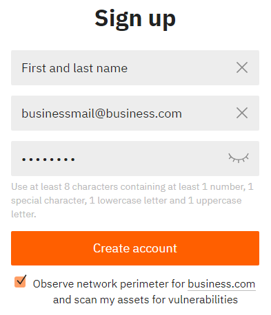
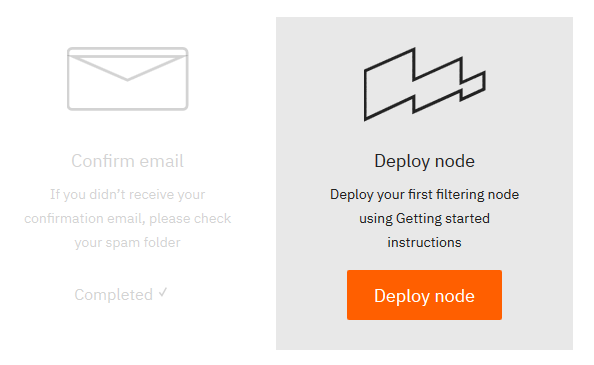

# Signing up with Wallarm

## 1. Create Your Wallarm Account

1. Go to 
--8<-- "en/cloud-include/wallarm-signup.md"
.
2. Enter the required data.

  

  !!! info "Business email
  > You can only sign up with a business email.

3. Click *Sign up*.

## 2. Confirm Your Email

After the successful registration, you will receive and automatic email with a confirmation link.

## 3. Get the License Key

After clicking the confirmation link, click *Deploy node*.

You will receive an automatic email with your license key attached to the message.

!!! info "See next"
    [Getting your UUID and secret key](partner-uuid-en.md)